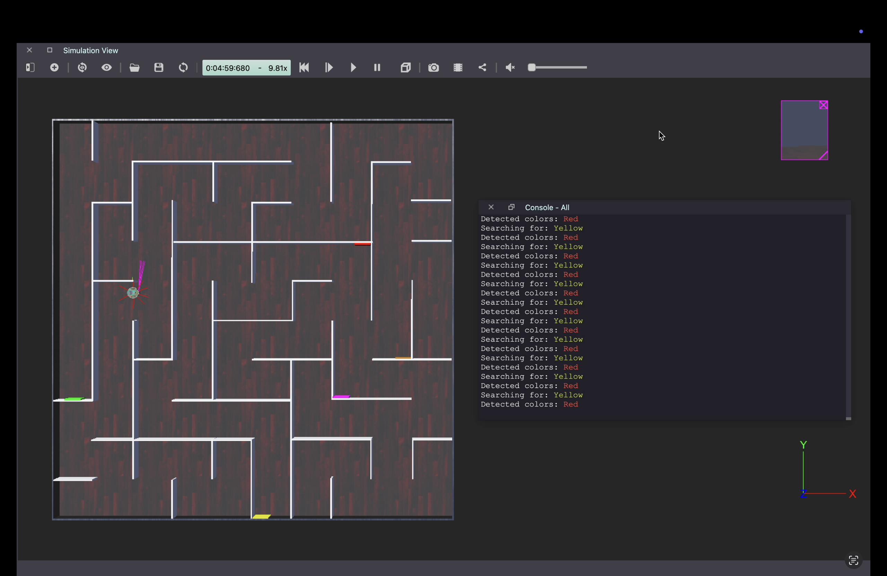

# RoboGames 2024 University Category

This repository contains the Webots world file and robot code for the RoboGames 2024 University Category challenge.

Read the preliminary round instructions [here](https://github.com/ragupari/Robogames-2024-Preliminary-Round/blob/acc582a44b04072c452a4c73fd31c705a1d10a31/University%20Category%20Task%20-%20Round%201.pdf)

The simulated demostration of the bot in the test environment can be watched [here.](https://www.youtube.com/watch?v=2gQ7UXonikw&sttick=0)

**Arena:**

*   Dimensions: 2.5m x 2.5m
*   Grid: 0.25m squares
*   Walls: Height: 0.1m, Width: 0.01m, Length: multiples of 0.25m
*   Colored Walls: Red, Yellow, Pink, Brown, Green (arranged in the specified pattern)

**Robot:**

*   Model: [E-Puck](https://www.cyberbotics.com/doc/guide/epuck?version=cyberbotics:R2019a#e-puck-model)
*   Sensors: Distance sensors, Camera sensor
*   Control Algorithm: [Left wall following - Maze escape algorithm](https://andrewyong7338.medium.com/maze-escape-with-wall-following-algorithm-170c35b88e00)
*   Color Recognition: Using camera aligned to left wall, adjusted width, height to detect a range of required color spectrum, hardcoded according to test env.

**Instructions:**

1.  Open the "****.wbt" world file and get "****.py" the controller file.
2.  Run the simulation in Webots.
3.  The robot should navigate the maze and stop after reaching the Green wall.

**Dependencies:**

*   Webots
*   Python

**Contributors:**

*   [@YPirasanth](https://github.com/YPirasanth/Pirasanth)
*   [@Kajaluxan](https://github.com/Kajaluxan)
*   [Myself](https://github.com/ragupari/)
